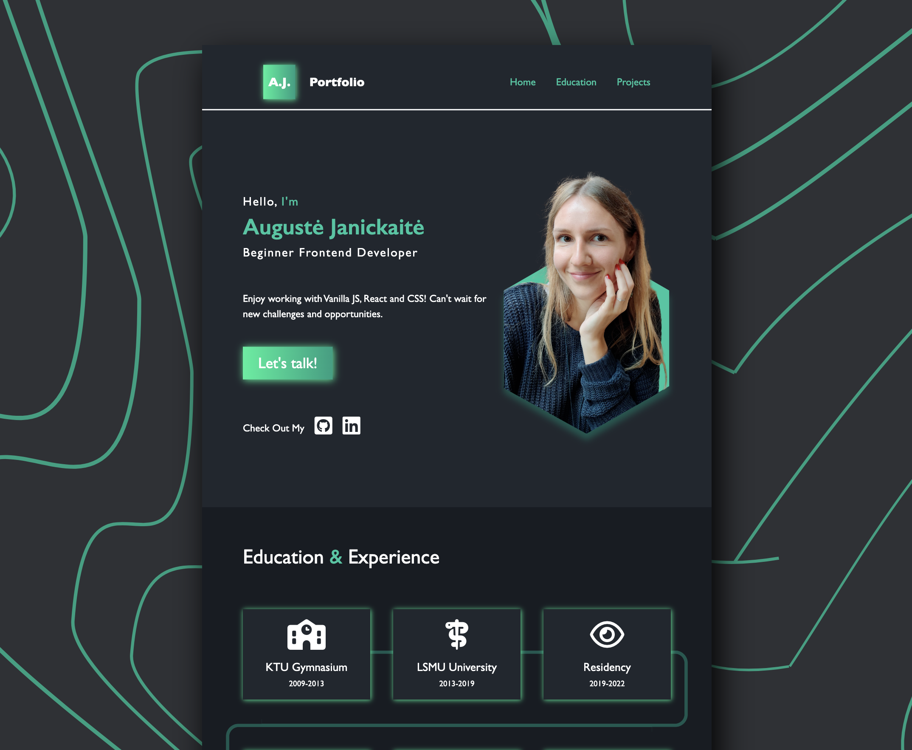

# Auguste Stankiene - My Portfolio

- The code was written by the author.

- Design was inspired by Tayyab Sajjad (https://www.behance.net/gallery/145464425/Portfolio-Website-Design?tracking_source=search_projects%7Cweb+design+portfolio)

## Table of contents

- [Overview](#overview)
  - [Functionality](#the-functionality)
  - [Screenshot](#screenshot)
  - [Links](#links)
- [Author](#author)

## Overview

### The functionality

Users should be able to:

- View the optimal layout for the app depending on their device's screen size
- See hover states for all interactive elements on the page
- Click on pictures and enter picture gallery type display
- Click on interactive cards and see modals with additional information

### Screenshot

### Links

- Live Site URL: (https://augustej.github.io)

## Author - Auguste Stankiene

- You can check out my Frontend Mentor account.
- Frontend Mentor - [@augustej](https://www.frontendmentor.io/profile/augustej)
